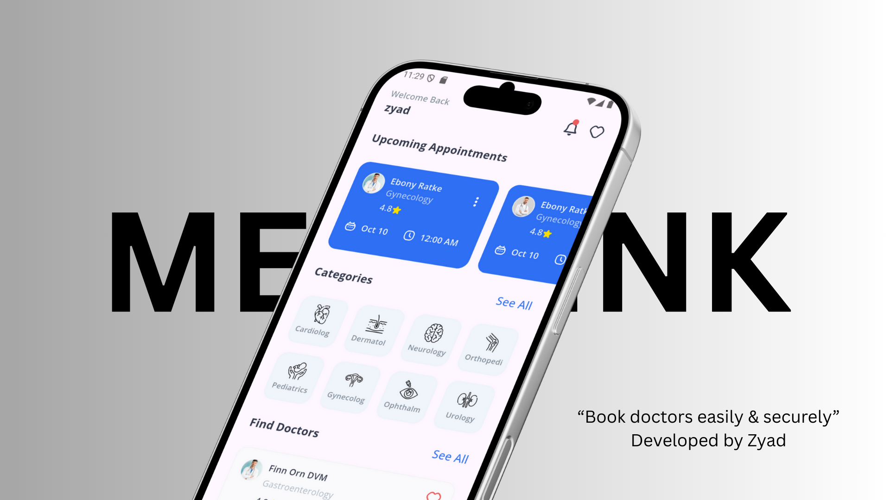
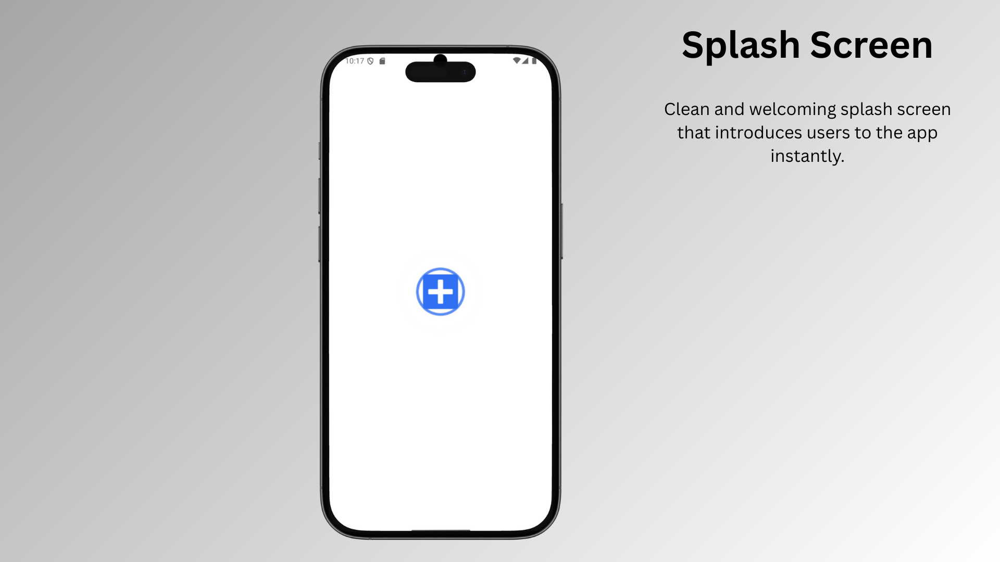
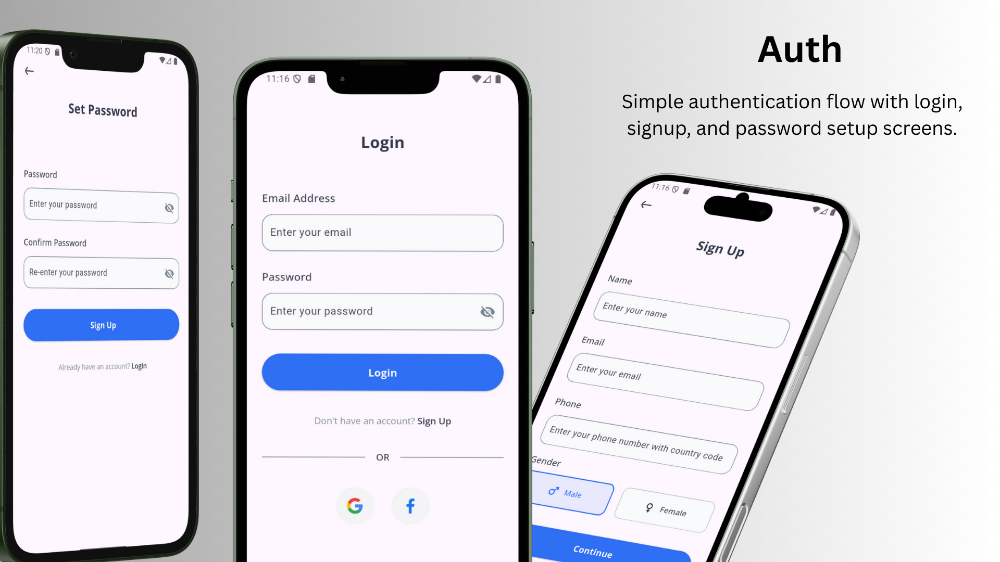
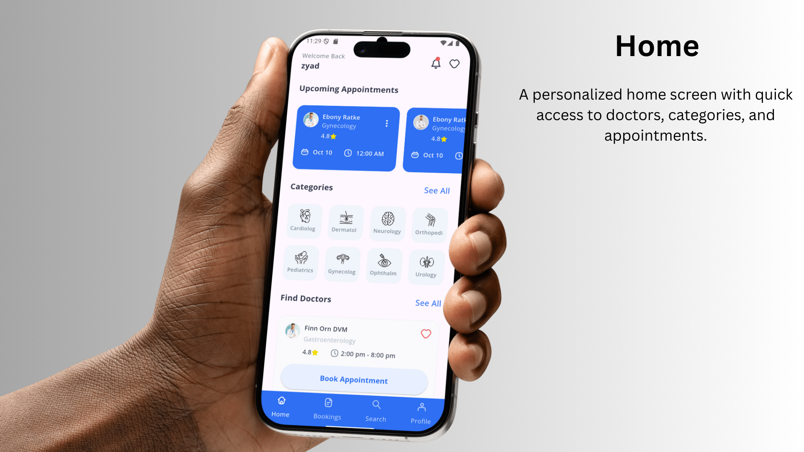
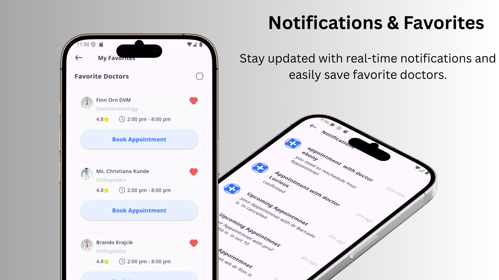
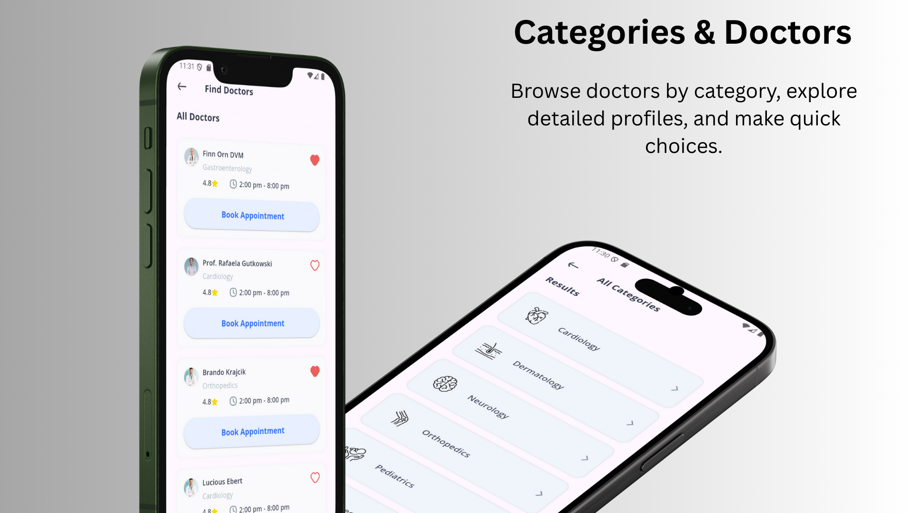
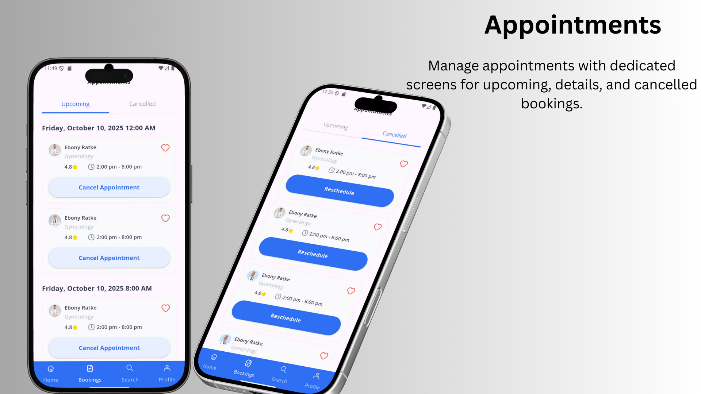
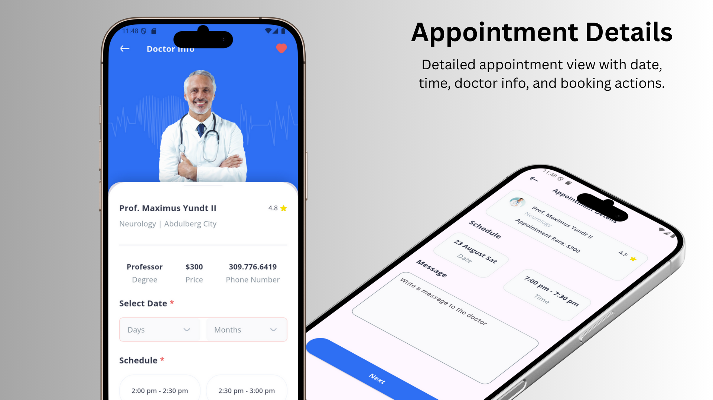
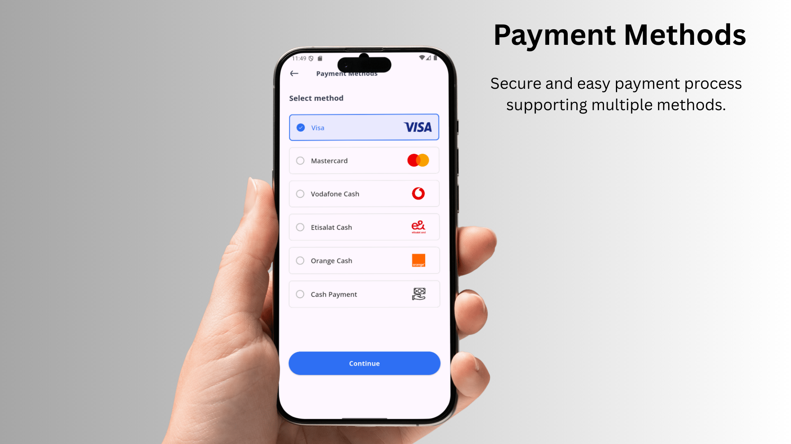
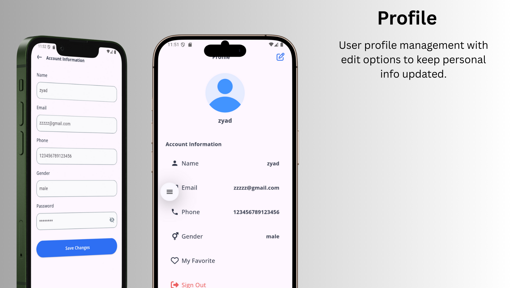

<div align="center">
  
</div>

# Medilink 🏥

**Your Complete Healthcare Companion**

Medilink is a comprehensive healthcare application that connects patients with healthcare providers, making medical care more accessible and efficient. Built with Flutter, this app provides a seamless experience for booking appointments, and staying connected with your healthcare journey.

## 📱 About the App

Medilink revolutionizes the healthcare experience by providing a digital platform where patients can easily find, connect with, and book appointments with healthcare professionals. The app streamlines the entire healthcare process, from initial consultation to follow-up care, ensuring users have access to quality medical services at their fingertips.

Whether you're looking for a specialist, need a routine check-up, or want to manage your health records, Medilink provides a user-friendly interface that makes healthcare management effortless and efficient.

## ✨ Key Features

### 🔐 **Authentication & Security**
- Secure user registration and login
- Social media authentication (Google, Facebook) coming soon
- Secure data storage with encryption
- Password recovery and account management

### 👩‍⚕️ **Doctor Discovery**
- Browse doctors by specialty categories
- Comprehensive doctor profiles with ratings and reviews
- Advanced search and filtering options
- Detailed doctor information including experience and qualifications

### 📅 **Appointment Management**
- Easy appointment booking system
- Real-time availability checking
- Appointment reminders and notifications
- Booking history and management
- Cancellation and rescheduling options

### 🏥 **Specialties Covered**
- **Cardiology** - Heart and cardiovascular care
- **Dermatology** - Skin and beauty treatments
- **Gastroenterology** - Digestive system specialists
- **Gynecology** - Women's health and reproductive care
- **Neurology** - Brain and nervous system disorders
- **Ophthalmology** - Eye care and vision health
- **Orthopedics** - Bone, joint, and muscle care
- **Pediatrics** - Children's health and development
- **Psychiatry** - Mental health and wellness
- **Urology** - Urinary system and male reproductive health

### 📱 **User Experience**
- Intuitive and modern UI design
- Smooth animations and transitions
- Responsive design for all screen sizes

### 🔔 **Notifications**
- Push notifications for appointments
- Medication reminders
- Health tips and updates

### 💳 **Payment Integration**
- Multiple payment options
- Secure payment processing
- Insurance integration support

## 🎨 UI Showcase

### App Screens Preview
<div align="center">
  
  
  
  
</div>

<div align="center">
  
  
  
  
</div>

<div align="center">
  
  
  
</div>


## 🛠️ Tech Stack

### **Frontend**
- **Flutter** - Cross-platform mobile development framework
- **Dart** - Programming language
- **Flutter Bloc** - State management solution
- **Flutter ScreenUtil** - Responsive UI design
- **Google Fonts** - Typography
- **Flutter SVG** - Vector graphics support
- **Lottie** - Animations and micro-interactions

### **Backend & APIs**
- **Dio** - HTTP client for API communication
- **Retrofit** - Type-safe API client generation
- **JSON Annotation** - JSON serialization
- **Pretty Dio Logger** - API request/response logging

### **Local Storage**
- **Hive** - Lightweight and fast NoSQL database
- **Shared Preferences** - Simple key-value storage
- **Hive Generator** - Code generation for Hive

### **Notifications & Messaging**
- **Firebase Messaging** - Push notifications
- **Flutter Local Notifications** - Local notification management

### **UI/UX Enhancements**
- **Skeletonizer** - Loading skeleton animations
- **Flutter Native Splash** - Custom splash screens
- **Font Awesome Flutter** - Icon library
- **Flutter InAppWebView** - Embedded web browsing

### **Development Tools**
- **Build Runner** - Code generation tool
- **Flutter Launcher Icons** - App icon generation
- **Flutter Lints** - Code quality and style checking
- **JSON Serializable** - JSON model generation

### **Architecture Pattern**
- **Clean Architecture** - Separation of concerns
- **Repository Pattern** - Data abstraction layer
- **Bloc Pattern** - Reactive state management
- **Dependency Injection** - Using GetIt for service location

## 📂 Project Structure

```
lib/
├── core/                    # Core functionality and utilities
│   ├── api_helpers/        # API handling and networking
│   ├── di/                 # Dependency injection setup
│   ├── favorites/          # Favorites functionality
│   ├── helpers/            # General helper functions and constants
│   ├── Hive/               # Local database setup and models
│   ├── model/              # Core data models
│   ├── notification/       # Notification services
│   ├── paymob/             # Payment gateway integration
│   ├── routing/            # App navigation and routing
│   ├── theme/              # App theming and styling
│   └── widgets/            # Reusable UI components
├── feature/                # Feature-based modules
│   ├── auth/              # Authentication feature
│   │   ├── data/          # Data layer (APIs, models, repos)
│   │   └── presentation/  # UI layer (screens, widgets, cubit)
│   ├── home/              # Home and dashboard
│   ├── booking/           # Appointment booking
│   └── profile/           # User profile management
└── main.dart              # App entry point
```

## 👨‍💻 Author

**Zyad Mostafa**
- LinkedIn: [Connect with me on LinkedIn](https://www.linkedin.com/in/zyaddmostafa/)
- GitHub: [@zyaddmostafa](https://github.com/zyaddmostafa)

---

<div align="center">
  <p>Made with ❤️ and Flutter</p>
  <p>© 2025 Medilink. All rights reserved.</p>
</div>
